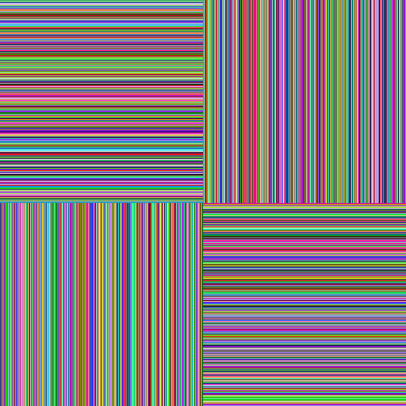

# IMAGES

Simple repository for my experiments in creating gif animations with rust.

### What I'm using

Besides the rust itself I'm also using the [image](https://lib.rs/crates/image), [gif](https://lib.rs/crates/gif) and [rand](https://lib.rs/crates/rand) crates.
